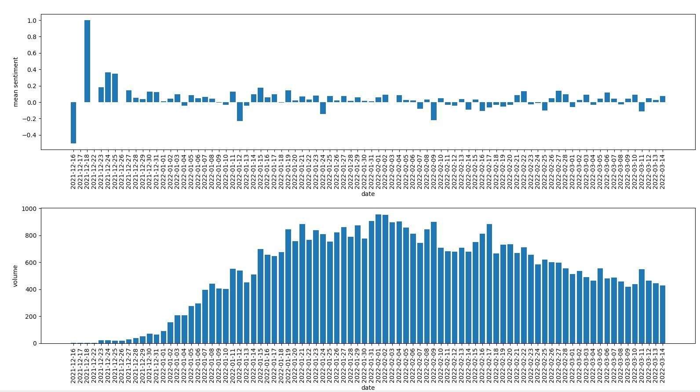

# Wordle
I analysed all the tweets from UK users mentioning 'Wordle', from 01/12/2021 to 15/03/2022

The analysis used a BERT model trained on twitter data (https://huggingface.co/cardiffnlp/twitter-roberta-base-sentiment)

From the results, pictured below, it seems that the frequency of negative sentiment days is increasing over time. This might be related to the NY times acquisition of the game, which occurred on 31st Jan 2022. On the other hand, this might simply be the natural development for a game that goes viral in the way that Wordle has.

 
